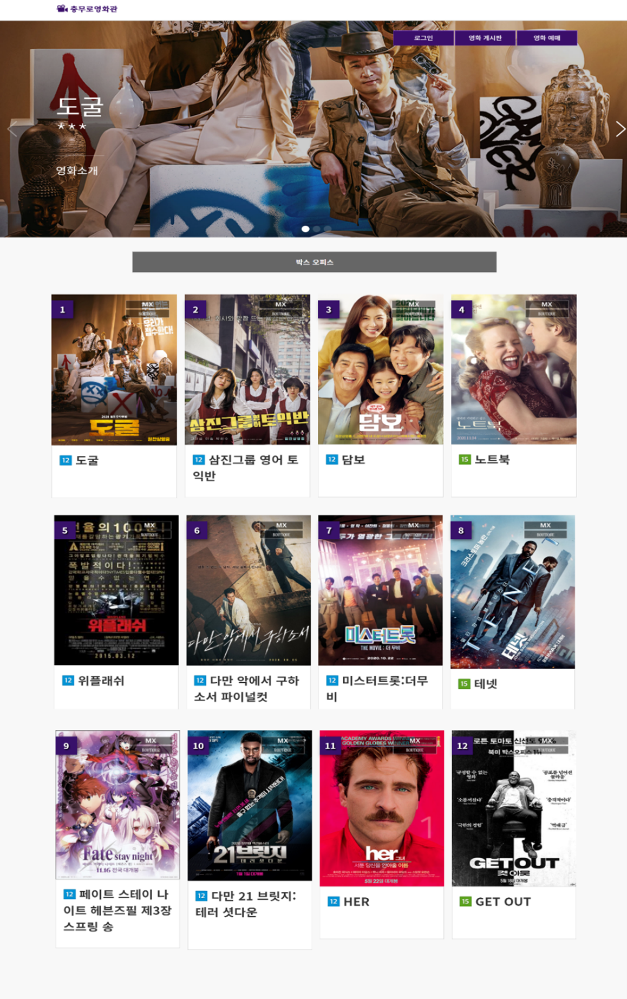
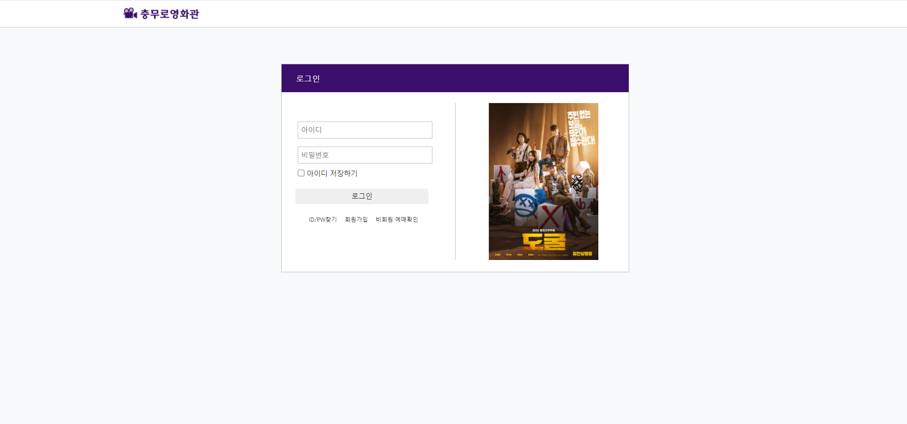
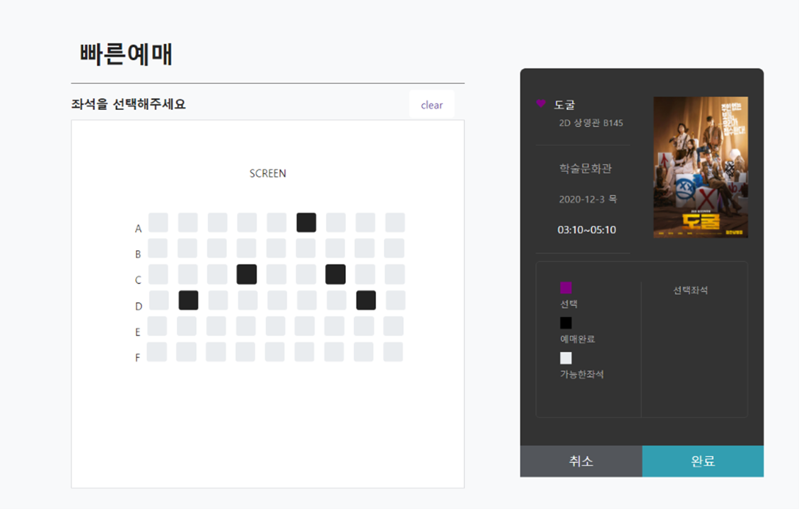
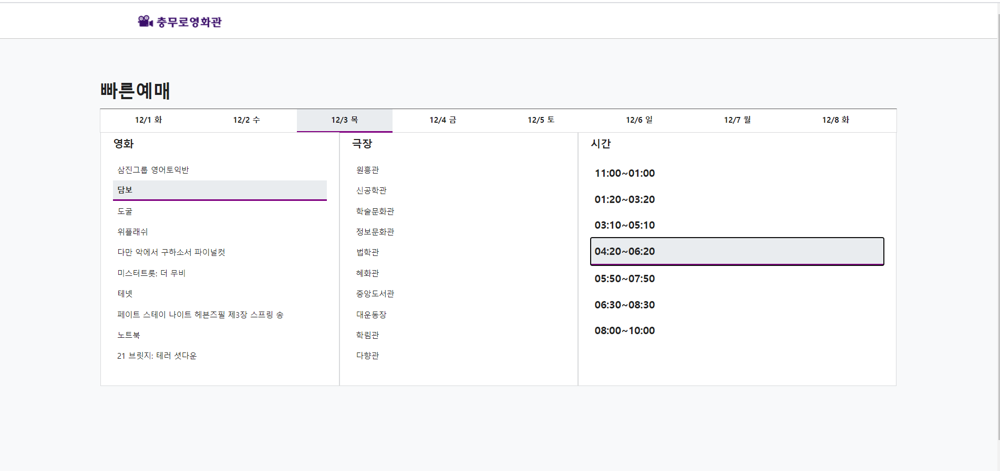
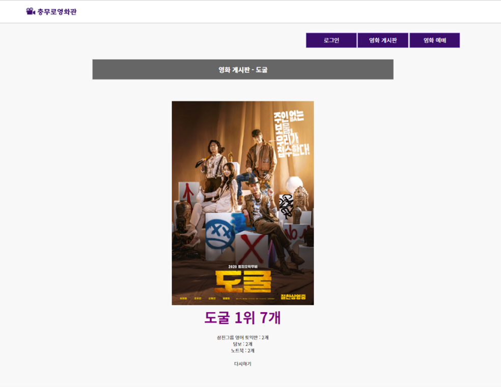
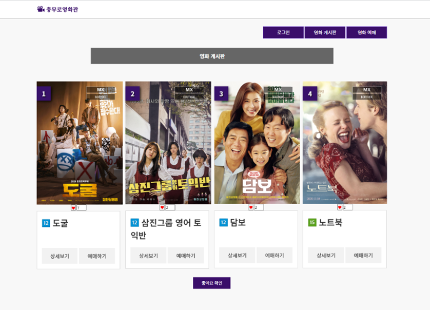
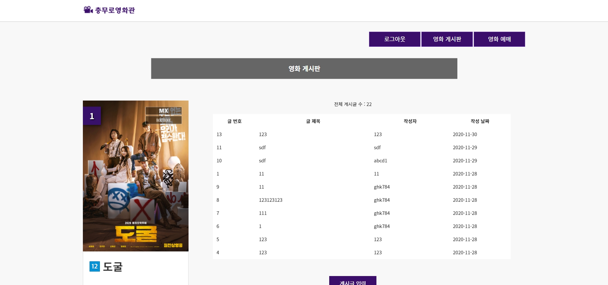

# web-project
* 2020-2 JSP 웹 프로그래밍 프로젝트
     
## 사용 기술
Frontend - Html, CSS, Javascript, Jquery, Bootstrap   
Backend - Jsp (java 8)   
Database - Mysql   
OS - window 10, ubuntu 20.04   
 
## 주요 기능
- 로그인, 회원가입   
- 게시판   
- 영화 예매   
  

## 구조

   

 

## 스크린샷
 

